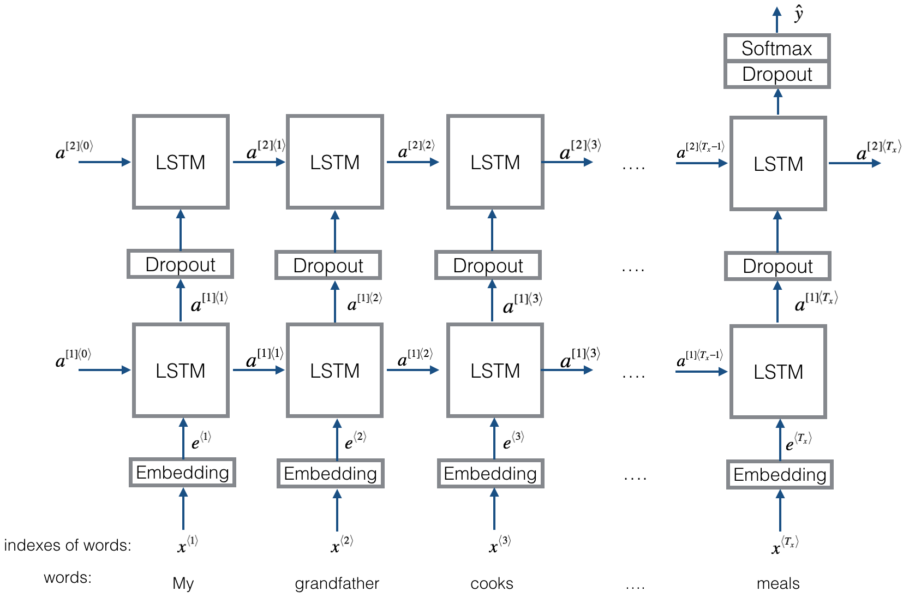

# Emojify

This repository is the implementation of Emojifier using word vector representations.
 
Input:
>"Congratulations on the promotion! Let's get coffee and talk."   

Output:
>"Congratulations on the promotion! 👍  Let's get coffee and talk. ☕️

The Emojifier is implemented in two ways:
1. Emojifier - V1


2. Emojifier - V2



### Dataset


## Setup
1. Clone this repository

```shell
git clone https://github.com/abel-shimeles/Emojify.git
cd Emojify
```

2. Download the [data](https://drive.google.com/file/d/1-Bq2kk97kXw21gLameX0nxsGBtqB_tIF/view) file from Google Drive then extract it. Put the extracted file in the root folder.


